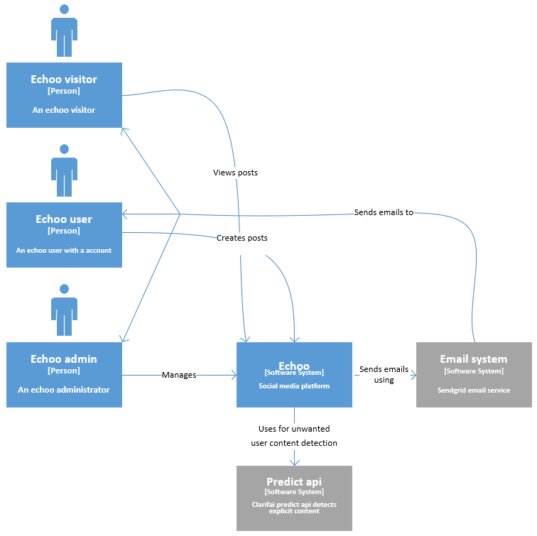

### Architectuur document
# Echoo 
## Inhoudsopgave

  - [Inleiding](#inleiding)
  - [Context diagram](#Context-diagram)
  - [Container diagram](#Container-diagram)
  - [Component diagram](#Component-diagram)
  - [Code diagram](#Component-diagram)
 

## Inleiding

In dit document wordt de structuur achter Echoo weergeven met behulp van het C4 model. Echoo maakt gebruik van een microservice architectuur in de onderstaande diagrammen word weergeven hoe Echoo intern en extern communiceert.

## Context diagram

De onderstaande diagram geeft een erg globaal overzicht van Echoo. Zo word er weergeven welke verschillende actors er gebruik maken van Echoo en met welke externe systemen echoo comuniceert

    

## Container diagram

In deze diagram word er weergegeven uit welke onderdelen Echoo bestaat. Zo zien we dat een actor gebruikt maakt van de React web applicatie die vervolgens API calls maakt naar de Spring Cloud Gateway, Deze Gateway stuurt de API call vervolgens door naar de desbetreffende microservice. Ook zien we dat microservices onderling communiceren met behulp van een Message broker(RabbitMQ)

## Component diagram

In de onderstaande diagrammen word weergegeven uit welk verschillende componenten de microservices bestaan

## Code diagram
